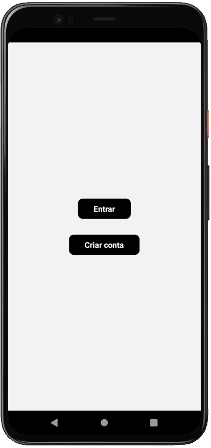

# iBuy

<p align="center">
  
  
  
</p>

<br>

## 💻 Projeto

**[iBuy](https://github.com/AdrianoTobias/ibuy)**, é uma aplicação mobile com o framework Expo, voltada à navegação.

O projeto explora a navegabilidade em dispositivos móveis, bem como o uso de "tabs" e drawer", além de rotas aninhadas.

É uma aplicação desenvolvida durante o **[MBA Fullstack](https://www.rocketseat.com.br/mba)**, provido pela **[Rocketseat](https://rocketseat.com.br/)**, em parceria com a **[Sirius Education](https://landing.sirius.education/home/)**.


## 🧪 Tecnologias

Esse projeto foi desenvolvido com as seguintes tecnologias:

- [React Native](https://reactnative.dev/)
- [Expo](https://expo.dev/)
- [TypeScript](https://www.typescriptlang.org/)


## 🚀 Como executar

Clonar o projeto e acessar a pasta do mesmo:

```bash
$ git clone https://github.com/AdrianoTobias/ibuy.git
$ cd ibuy
```

Para iniciá-lo:
```bash
# Instalar as dependências
$ npm install
```

```bash
# Iniciar a aplicação
$ npx expo start
```
A aplicação poderá ser acessada via dispositivo (físico ou emulador), através do [Expo Go](https://docs.expo.dev/get-started/set-up-your-environment/).


[Adriano Tobias](https://github.com/AdrianoTobias)